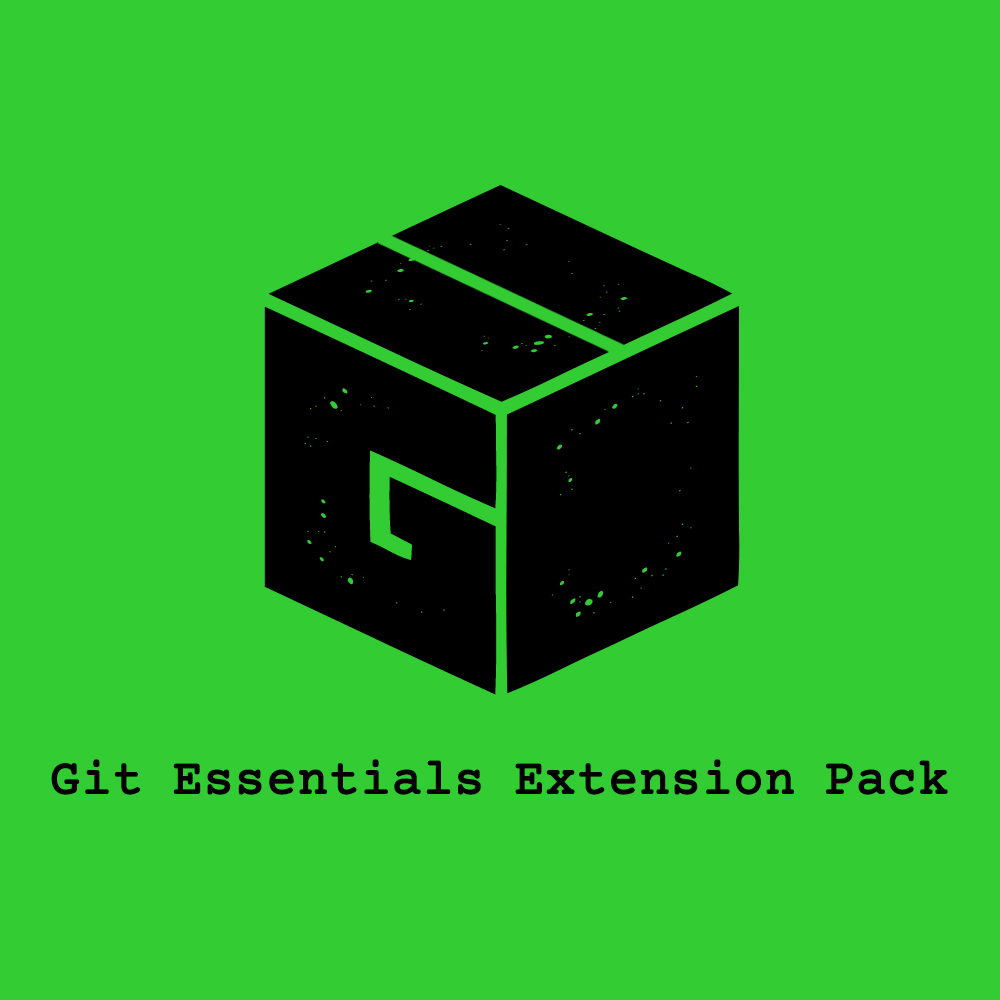

# Visual Studio Code Git Extension Pack (GPack)

### GPack

Git Essentials Extension Pack for Visual Studio Code (GPack)

## Extensions Included

- 1- [Git History](https://marketplace.visualstudio.com/items?itemName=donjayamanne.githistory) - View git log, file history, compare branches or commits

- 2- [GitLens — Git supercharged](https://marketplace.visualstudio.com/items?itemName=eamodio.gitlens) - Supercharge the Git capabilities built into Visual Studio Code — Visualize code authorship at a glance via Git blame annotations and code lens, seamlessly navigate and explore Git repositories, gain valuable insights via powerful comparison commands, and so much more

- 3- [Git Graph](https://marketplace.visualstudio.com/items?itemName=mhutchie.git-graph) - View a Git Graph of your repository, and perform Git actions from the graph.

- 4- [Git File History](https://marketplace.visualstudio.com/items?itemName=pomber.git-file-history) - Modern, fast and intuitive tool for browsing the history and files in any git repository

- 5- [Conventional Commits](https://marketplace.visualstudio.com/items?itemName=vivaxy.vscode-conventional-commits) - 💬Conventional Commits for VSCode.

- 6- [Checkpoints](https://marketplace.visualstudio.com/items?itemName=micnil.vscode-checkpoints) - Checkpoints(using `ctrl+alt+s`) used in between commits for keeping a local short-term history of work in progress files, like bookmarks in you undo-stack.

## Recommended Extension pack

[ZPack](https://marketplace.visualstudio.com/items?itemName=SeyyedKhandon.zpack) is An Opinionated collection of the `best` and `most` used extensions for Web Developers in VSCode which has Better `Developer Experience(DX)` and `load time` in Mind.

## Relevant Links

- [Github](https://github.com/SeyyedKhandon/gpack)
- [VS Code Marketplace](https://marketplace.visualstudio.com/items?itemName=SeyyedKhandon.gpack)

**Enjoy!**
